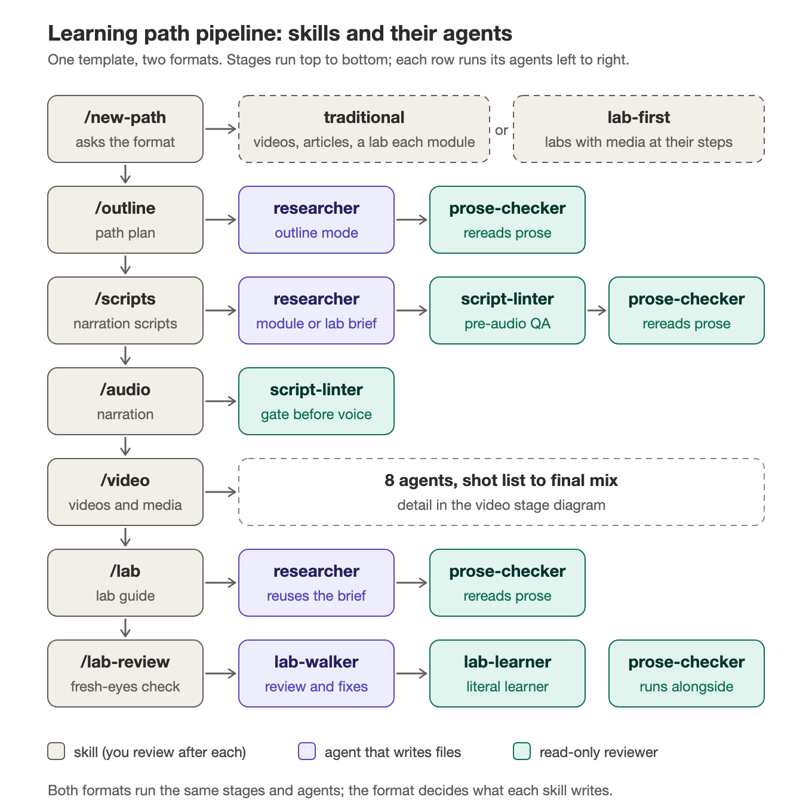
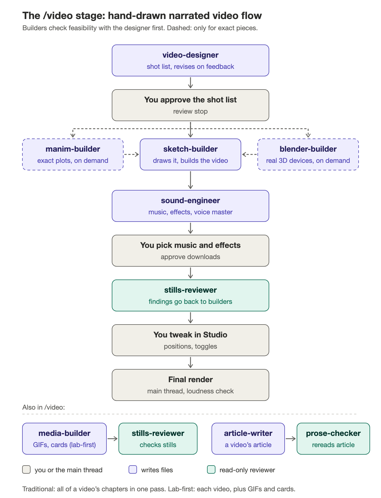

# Learning-path pipeline

A complete starter template for producing IT-training learning paths with
Claude Code, in either of two formats. You choose one when you create a path:

- **Traditional:** a video course. Modules of 4-6 narrated videos (4-6
  minutes each, split into 2-4 chapters you cut between your screencasts in
  Premiere), an article with every video, and a closing hands-on lab per
  module. Worked example: Linux Intermediate
  (`formats/traditional/linux-intermediate-path.md`).
- **Lab-first:** the labs are the course. Learners spend most of their time
  at the terminal, and each lab step embeds the help it needs: a short
  silent GIF before a step, a 30-90 second narrated micro-video after a
  predict step, a static reference card for lookup. Guidance fades lab by
  lab, and a challenge-style capstone closes the path. Worked example:
  `formats/lab-first/linux-filesystem-path.md`.

Both formats make their videos the same way: hand-drawn explainers (marker
lettering and doodles drawn on as the narrator speaks, on the WWT navy
ground), designed by a video-designer agent, drawn by a sketch-builder,
scored and levelled by a sound-engineer, and reviewed from stills. The repo
holds the Remotion toolkit, the ElevenLabs, whisper.cpp, and caption helper
scripts, the `CLAUDE.md` instruction set, the slash-command skills and
agents that take a topic from a researched outline to rendered media and
WWT lab guides, and a worked example per format. Built on Linux courses;
written so the same pipeline produces a Windows Server, PowerShell, Cisco,
or cloud learning path without changing the skills.

Works on macOS and Windows. Setup is about 20 minutes plus download time.

## 1. Install the tools

You need Git, Node.js 22 or newer, Python 3, Google Chrome, and Claude Code.
Everything else (Remotion, its headless browser, ffmpeg, whisper.cpp)
installs itself on first use.

### macOS

Open Terminal and run these one at a time.

```bash
xcode-select --install
```

That gives you `git`, `make` and `python3` (whisper.cpp compiles from source
on macOS and needs `make`). If a dialog appears, accept it and wait for it to
finish before continuing.

```bash
curl -o- https://raw.githubusercontent.com/nvm-sh/nvm/master/install.sh | bash
```

Close and reopen Terminal, then:

```bash
nvm install 22
```

```bash
node -v
```

Expect `v22.x.x` or newer. Install Chrome if you don't have it (download
from google.com/chrome, or `brew install --cask google-chrome` if you use
Homebrew). Then Claude Code:

```bash
curl -fsSL https://claude.ai/install.sh | bash
```

Or install the Claude desktop app and use its Code tab. Either way, run
`claude` once from any folder and sign in.

**The one macOS gotcha:** nvm adds Node to your interactive shell only.
Claude Code runs commands in a non-interactive shell, so `node` and `npx`
are not found there. `CLAUDE.md` tells Claude to prefix every command with
the PATH export shown below; you only need to do it yourself when you run
commands by hand.

```bash
export PATH="$HOME/.nvm/versions/node/$(ls ~/.nvm/versions/node | tail -1)/bin:$PATH"
```

### Windows

Open PowerShell (not as administrator) and run these one at a time.

```powershell
winget install --id Git.Git -e
```

```powershell
winget install --id OpenJS.NodeJS.LTS -e
```

```powershell
winget install --id Python.Python.3.12 -e
```

```powershell
winget install --id Google.Chrome -e
```

Close and reopen PowerShell so PATH picks up the new tools, then check:

```powershell
node -v; git --version; python --version
```

Expect Node `v22.x.x` or newer. Then Claude Code:

```powershell
irm https://claude.ai/install.ps1 | iex
```

Or install the Claude desktop app and use its Code tab. Run `claude` once
from any folder and sign in.

Windows notes: Node installed this way is on PATH everywhere, so ignore the
nvm PATH line in `CLAUDE.md` (delete it in your course's copy). whisper.cpp
downloads a prebuilt binary on Windows, no compiler needed. The scripts use
`tar`, which Windows 10 and 11 ship with.

## 2. Get the repo and check it works

Pick a folder for your learning paths (each course becomes a sibling folder
next to this one). Then:

macOS:

```bash
git clone https://github.com/willrobertson23wwt/learning-path-pipeline.git
```

```bash
cd learning-path-pipeline && export PATH="$HOME/.nvm/versions/node/$(ls ~/.nvm/versions/node | tail -1)/bin:$PATH" && npm ci
```

```bash
cp .env.example .env
```

```bash
npx tsc --noEmit && npx remotion still ExampleCh1 out/smoke.png --frame=300
```

Windows:

```powershell
git clone https://github.com/willrobertson23wwt/learning-path-pipeline.git
```

```powershell
cd learning-path-pipeline; npm ci
```

```powershell
Copy-Item .env.example .env
```

```powershell
npx tsc --noEmit; npx remotion still ExampleCh1 out/smoke.png --frame=300
```

The first `remotion` command downloads a headless browser (about 150 MB) and
takes a minute. If `out/smoke.png` appears and shows a dark editor panel with
a `cleanup.sh` script in it, the toolkit works on your machine.

Now open `.env` and paste in your ElevenLabs API key and voice ID. The voice
ID is on the voice's page in ElevenLabs (Voices, then the voice, then ID).
The model defaults to `eleven_v3`; stability and seed are optional.
`.env` is gitignored; every team member uses their own.

Optional but recommended: preview the example in Remotion Studio to see what
a finished video composition looks like and how the props panel works.

```bash
npm run studio
```

## 3. Start a learning path

Open Claude Code in this folder (`claude` in the terminal, or open the folder
in the desktop app's Code tab) and type:

```
/new-path PowerShell Fundamentals
```

Claude asks which format you want (traditional or lab-first), copies the
toolkit, shared skills, agents and scripts plus that format's skills into a
sibling folder (`../powershell-fundamentals/`), fills in the format's
sections of that folder's `CLAUDE.md` and house style, sets the package
name, asks you for the platform details it can't infer (shell and prompt,
elevation model, lab environment, course prefix), fills in the Platform
profile, installs, typechecks, renders the smoke still, and inits git. All
course work happens in that folder, never in this one.

Then open Claude Code in the new folder and work through the stages. Each
one writes plain files and stops for your review before the next.

**Traditional path:**

| Stage | Command | Writes | You review |
|---|---|---|---|
| 1. Outline | `/outline <topic>` | `courses/<slug>/outline.md`: modules, videos and their chapters, a lab per module | an interactive plan: scope questions, research findings and suggested shapes, a skeleton, then the draft; set `status: approved` when happy |
| 2. Scripts | `/scripts <slug> [video]` | `courses/<slug>/scripts/NN-<video>/MM-<chapter>.md`, plus each video's `00-intro.md` | narration + visual briefs per chapter |
| 3. Audio | `/audio <slug> [video]` | `public/chapters/<chapter-id>/narration.mp3`, transcript, and captions | listen to every chapter |
| 4. Video | `/video <slug> <video>` | the designer's shot lists (you approve them), then `deliverables/<chapter-id>.mp4` + `.vtt` per chapter, and the video's article | the chapters; you assemble the video in Premiere with your screencasts |
| 3+4 | `/produce <slug> <video>` | both of the above in one shot | once you trust the scripts |
| Labs | `/lab <slug> <module>`, then the lab skills below | the module's closing lab as a WWT repo draft in `labs/<lab-slug>/` | the guide, then the diagram |

Chapter IDs tie each stage together: `<prefix>-v3-ch2` is chapter 2 of video
3, `<prefix>-v3-intro` its chapter 0 (narration over your custom intro
footage).

**Lab-first path:**

| Stage | Command | Writes | You review |
|---|---|---|---|
| 1. Outline | `/outline <topic>` | `courses/<slug>/outline.md`: labs, guidance levels, steps, and a media inventory | an interactive plan: scope questions, research findings and suggested shapes, a skeleton, then the draft; set `status: approved` when happy |
| 2. Scripts | `/scripts <slug> [lab]` | `courses/<slug>/scripts/NN-<lab>/<media-id>.md` | narration + visual briefs for videos, loop specs for GIFs, layouts for cards |
| 3. Audio | `/audio <slug> [lab]` | `public/chapters/<media-id>/narration.mp3`, transcript, and captions | listen to every track |
| 4. Video | `/video <slug> <lab>` | shot lists for each video (you approve them), then `deliverables/<media-id>.mp4` + `.vtt` for videos, `.mp4` + `.png` poster for GIF loops, `.png` for cards, and articles for standalone videos | the MP4s, GIFs, cards, and captions |
| 3+4 | `/produce <slug> <lab>` | both of the above in one shot | once you trust the scripts |
| Labs | `/lab <slug> <lab \| capstone \| 0>`, then the lab skills below | one WWT repo draft per lab in `labs/<lab-slug>/`, the capstone repo with its Solutions page, the path page for `0` | the guide, then the diagram |

Media IDs tie each stage together: `<prefix>-briefing`, `<prefix>-l3-v1` (a
micro-video in Lab 3), `<prefix>-l3-g1` (a GIF), `<prefix>-card-<name>`.

**Both formats:**

| Stage | Command | Writes | You review |
|---|---|---|---|
| Lab review | `/lab-review <lab>`, `/lab-topology <lab>` | a documentation-only cleanup of the drafted lab (index, environment, module pages, a quickref login page when there's more than one device, internal SETUP, SUPPORT, LISTING, `shots_spec.py`, dryrun states) and its topology SVG | the review report and the diagram |
| Lab build | `/lab-build <lab>` | `lab.yaml` + `PLAN.md` in [Lab Builder](https://github.com/willrobertson23wwt/Lab-Builder) and a `terraform plan` of the vApp | the plan; you run the build |
| Lab setup | `/lab-setup <lab> <vapp-address>` | the guests built over SSH from SETUP.md (audit, upgrade, idempotent `dryrun/setup.sh`), as-found notes, and the quickref page's management IPs | the audit and the setup log; then the dry run and screenshots |
| Done | `/closeout <slug> [A-B]` | `archives/<slug>-<date>.zip` + manifest; optional render purge | the dry-run plan, then the purge question |

Edit any file and rerun just that stage for one video or lab. Nothing
advances automatically.

Along the way, agents in `.claude/agents/` do focused work in their own
context: `researcher` runs cited web research before the outline and each
lab or module, `script-linter` checks scripts before any narration credits
are spent, `video-designer` writes each video's shot list, `sketch-builder`
draws it, `sound-engineer` picks the music and effects and sets the levels,
`manim-builder` and `blender-builder` make exact plots and 3D devices on
demand, `media-builder` builds each GIF and card (lab-first),
`stills-reviewer` checks every item's stills before it renders,
`article-writer` writes articles, `prose-checker` rereads learner prose for
AI tells, and `lab-walker` and `lab-learner` review each drafted lab.

## How the agents work together

Every skill and the agents it runs, in both formats:



The `/video` stage in detail:



The diagrams are drawn by `docs/diagrams/agent-diagrams.py` (plain Python);
update it when a skill or agent changes.

## What is in this repo

| Path | What it is |
|---|---|
| `CLAUDE.md` | Project instructions Claude Code loads. Platform-neutral except the **Platform profile** section, which each course fills in. |
| `docs/diagrams/` | The agent diagrams above (SVG and PNG) and the script that draws them. |
| `formats/traditional/`, `formats/lab-first/` | What differs by format: the `/outline`, `/scripts`, `/audio`, `/video`, `/article`, `/produce` and `/lab` skills, the `researcher`, `script-linter` and `article-writer` agents, the worked example path, and the fragments that fill the FORMAT sections of `CLAUDE.md` and the house style. `/new-path` applies one with `scripts/apply-format.mjs`. |
| `.claude/house-style.md` | Rules the skills share: the template guard, the course-design rules (filled in per format), learner-prose rules, and research-brief reuse. |
| `.claude/references/` | The video playbook (`video-design.md` and its three cited briefs), the hand-drawn house style (`sketch-style.md`), the sound rules (`sound-design.md`), the Manim and Blender styles, the writing research, and worked examples (`examples/li-v6-ch1-hd/`, a hand-drawn chapter; `examples/li-v6-ch1/`, the Manim version). |
| `.claude/style-guide.md` | The writing style guide: the Google developer documentation style guide as the base manual, with house departures and numbered rules for voice, global English, mechanics, formatting, procedures, inclusive language, and brief citations. Review agents cite its rule IDs. |
| `.claude/references/writing/` | The cited research behind the style guide and the script rules (technical writing, style manuals, and writing for technical video). |
| `.claude/skills/new-path` | `/new-path <topic>` asks the format and scaffolds a new course folder from this repo. The only skill that runs here. |
| `.claude/skills/unslop` | `/unslop <path>` strips AI tells from learner-facing prose. Other skills call it. |
| `.claude/skills/lab-review` | `/lab-review <lab-slug>` documentation-only cleanup of a drafted lab before the VM exists. |
| `.claude/skills/lab-topology` | `/lab-topology <lab-slug>` draws the lab's environment SVG and writes its alt text into LISTING.md. Includes a single-VM template. |
| `.claude/skills/lab-setup` | `/lab-setup <lab-slug> <vapp-address>` builds a delivered vApp's guests over SSH from SETUP.md and records the as-found state. |
| `.claude/skills/labdrop` | `/labdrop <learning path>` builds the ATC Lab Drop promo video. |
| `.claude/skills/closeout` | `/closeout <slug> [A-B]` zips a finished path's deliverables, narration, captions, specs, articles, and research briefs with a sha256 manifest, verifies the zip, and on your say-so deletes the multi-GB renders in `out/`. |
| `.claude/agents/` | The review and build agents the skills launch (listed above). |
| `src/components/sketch/`, `src/assets/hand/` | The hand-drawn video toolkit: marker ink, single-line hand lettering, rough shapes and doodles, sheet wipes, the navy ground and title light, the hand-lettered thank-you card. |
| `src/components/` | The shared toolkit: `theme.ts` (the WWT palette), `MixTrack.tsx` (the sound engineer's mix), `ManimLayer.tsx`, `layout.tsx` (Studio props schema plumbing), `TitleCard`, `ThankYouCard`, `Backdrop` (paper + fluid loop), `HudIcon` (Lottie badges), `terminal/kit.tsx` (`TermWindow`, type-on, pills, easing helpers), `BulletList`, `LowerThird`, `PrinciplePanel`, `Waveform`, `icons/`. |
| `src/ExampleCh1.tsx`, `src/components/example-ch1/`, `public/chapters/example-ch1/` | One complete worked video composition (bespoke, schema-driven, with its narration and transcript). Renders as `ExampleCh1`. Every convention in `CLAUDE.md` points at it. |
| `src/Chapter.tsx`, `src/types.ts`, `src/chapters/example-generic/` | The generic data-driven chapter pattern (`timeline.json` of cues) for simple title/bullet chapters. |
| `src/Root.tsx`, `src/constants.ts`, `src/index.ts` | Composition registry with the `audioMetadata` helper, `FPS` and buffer constants, entry point. |
| `public/backgrounds/` | The paper texture and dark fluid loop `Backdrop` uses. |
| `scripts/` | `apply-format.mjs` (applies a format in `/new-path`), `beats.mjs` (beat timings from the transcript), `stills.mjs` (many stills from one bundle), `hand-font.mjs`, the Manim scripts, `generate-audio.mjs` (ElevenLabs), `transcribe.mjs` (whisper.cpp timings), `captions.mjs` (WebVTT captions with text from the script and timings from whisper, phonetic spellings mapped back to real syntax, and reading-rate checks), `closeout.mjs` (archive + purge), `lab-terminal-shot.py` (portal-look terminal screenshots), `lab-ssh` and `lab-scp` (password SSH for `/lab-setup`, password from `LAB_PASS`), `prepare-hud.mjs` (Lottie icon prep). |
| `package.json`, `package-lock.json`, `tsconfig.json`, `remotion.config.ts`, `.env.example` | Pinned toolchain. zod must stay at 4.3.6 for `@remotion/zod-types`. |

## Also needed, not in the repo

- **An ElevenLabs account** with a cloned or chosen voice. Narration is one
  API request per chapter (traditional) or per micro-video (lab-first).
- **An Epidemic Sound account**, connected to Claude, for the music and
  effects the sound engineer picks (you approve each download).
- **The WWT ATC lab portal** to host each lab repo, with the guide beside a
  browser terminal to the lab VM. The portal can't run automated checks yet,
  so labs have none.
- **A licensed stock-asset library** (Envato or similar) for extra icons,
  backdrops, and Lab Drop music. Put its path in `CLAUDE.md`. The prepared
  Lottie badges the toolkit ships with are enough to start.

## How vendor-neutrality works

The skills never hard-code a shell, a prompt, or an OS. Where a rule depends
on the platform, the skill says "per the platform profile in CLAUDE.md" and
gives one example per family (bash, PowerShell, device CLI):

- **Narration** spells commands the way the voice should say them and puts
  real syntax in the visual brief. The phonetic list of names the TTS mangles
  lives in the platform profile, so a PowerShell course grows its own list.
- **Terminal panels** (`TermWindow`) are a generic dark console. The prompt
  string and syntax colors are set per video or GIF.
- **Articles and labs** tag code blocks with the platform's language
  (`bash`, `powershell`, `text` for device CLIs).
- **Lab guides** take the environment default, the credentials row, the
  prompt for rendered screenshots, the "first elevated command" note, and
  the output-trimming rule from the profile. GUI-driven steps get a
  screenshot placeholder per dialog.
- **Lab review** keeps its Linux-derived checklist as the example set and
  adds a "Platform equivalents" section (PowerShell, Cisco IOS, web
  consoles) as the starting point for translating each check.
- **Captions** show real syntax: the text comes from the script, and
  `courses/<slug>/caption-map.json` maps the narration's phonetic spellings
  back (`"ess ess"` to `ss`).
- **GIF loops** ship as muted MP4s that autoplay with a pause control
  (WCAG 2.2.2), with a PNG poster, not as `.gif` files.
- **Callbacks** describe the concept ("the inodes model from the links
  lab"), never a video or lab number.

What stays WWT-specific on purpose: the ATC Lab Portal access model (one
browser tab per device), the WWT logo and mkdocs format in labs, the
`SETUP.md`/`SUPPORT.md` internal files, and the Lab Drop branding.

## Troubleshooting

- **`node: command not found` inside Claude Code on macOS.** The nvm PATH
  gotcha above. Make sure the export line in `CLAUDE.md` names the Node
  version you actually have (`ls ~/.nvm/versions/node`).
- **`npx tsc` installed something and printed nonsense.** You ran it outside
  the project folder. `cd` in and rerun.
- **zod version warning on every render.** Something changed `zod` away from
  `4.3.6`. Run `npm ci` to restore the lockfile's versions.
- **whisper.cpp build fails on macOS.** Xcode Command Line Tools are missing
  or half-installed. Rerun `xcode-select --install`.
- **Chrome not found by `lab-terminal-shot.py` or the topology check.** Set
  `CHROME` to the browser's full path (the script checks the usual macOS and
  Windows locations first).
- **ElevenLabs errors.** The script prints the API's response body; quota and
  voice-ID mistakes are self-explanatory there. Check `.env`.
- **Studio props panel shows nothing.** The composition has no `schema`; see
  `exampleCh1Schema` in `src/ExampleCh1.tsx` for the pattern.

## Where this came from

The toolkit and skills were built across two Linux courses in the
`remotion-training-graphics` and `linux-intermediate` repos. This repo
replaces the first as the template: the shared components and helper scripts
are the newer `linux-intermediate` versions, the worked example is that
course's first chapter renamed, and the per-video course log that lived in
its `CLAUDE.md` was distilled into the platform-neutral **Lessons learned**
section. Course-specific chapters, audio, and the raw Envato icon pack were
left behind on purpose.

The pipeline started out video-first (4-6 minute narrated videos cut between
screencasts, with a lab at the end of each module), moved to lab-first
paths developed in the `Lab-based-learning-path` template folder, and now
holds both as formats (2026-09-25): the traditional format is the
linux-intermediate structure on the current tooling, and the lab-first
template folder was merged in and retired. The hand-drawn video style
replaced the earlier Remotion and Manim looks after an A/B of the same
chapter in all three.
